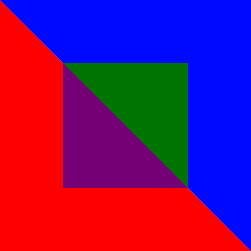

# SVG Multi Color Icons

Multi colored SVG icons, as symbols, included with `<use>`.

All colors are set with CSS vars.

Credit to [Sarah Dayan](https://medium.freecodecamp.org/lets-make-your-svg-symbol-icons-multi-colored-with-css-variables-cddd1769fca4).
